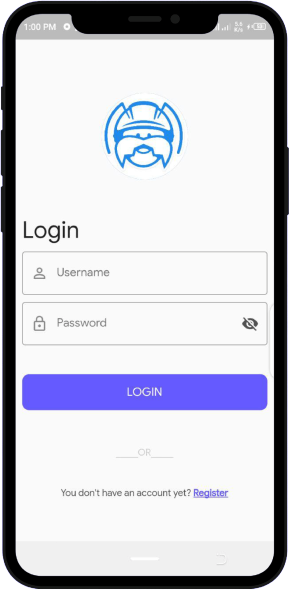
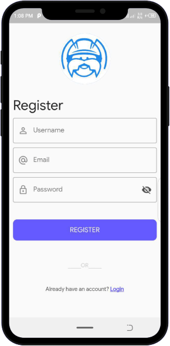
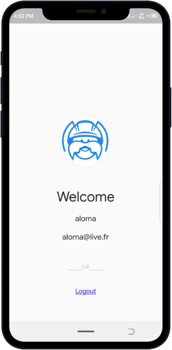

# 🗝 Flutter Login & Registration Using Back4App  

This project demonstrates how to use [Back4App](https://github.com/phillwiggins/flutter_parse_sdk) to authenticate users in a flutter application. 

### 📸 Screenshots

| Login Page        | Register Page | Welcome Page |
| ------------- |:-------------:| :-------------:|
|  |  |  |

## 🚀 Getting Started with Flutter

* For help getting started with Flutter, view our online [documentation](http://flutter.io/).

## **Developer Info**

- <a href="https://github.com/gausoft">Github</a>

- <a href="https://www.facebook.com/gauthier.eh">Facebook</a>

- <a href="https://www.instagram.com/gausoft/">Instagram</a>

- <a href="https://twitter.com/gausoft_">Twitter</a>

# 📃 License
Have a look at the [license file](./LICENSE) for details